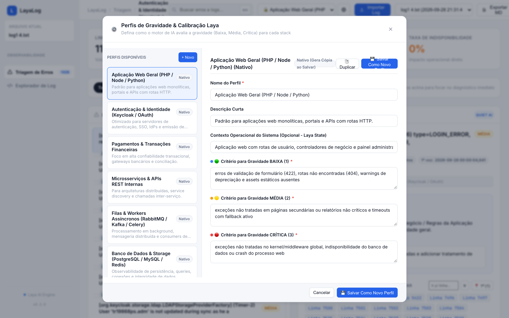
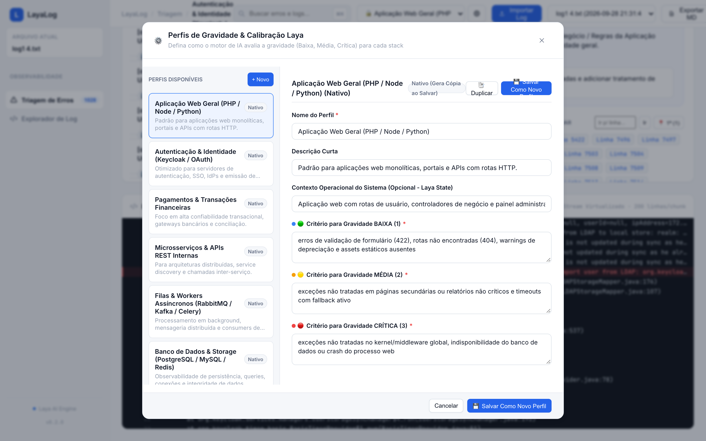

# ⚡ LayaLog — Observabilidade Semântica & Diagnóstico de Logs com IA

<p align="center">
  <a href="https://www.python.org/downloads/"></a>
  <a href="https://fastapi.tiangolo.com/"></a>
  <a href="https://github.com/typesafe-ai/laya"></a>
  <a href="https://docs.pytest.org/"></a>
  <a href="LICENSE"></a>
</p>

---

## 📖 Visão Geral

**LayaLog** é uma plataforma de observabilidade e triagem inteligente para análise em tempo real de logs corporativos volumosos. Em vez de inspeções manuais exaustivas em arquivos de texto de dezenas de megabytes, o LayaLog combina **agrupamento inteligente por assinatura de erro**, **streaming em tempo real com NDJSON** e os modelos de decisão **Laya AI (System One)** para gerar diagnósticos estruturados, determinar a causa raiz, classificar a gravidade e apontar ações de mitigação recomendadas.

---

## ✨ Screenshots do App

### 1. Calibração e Perfis de Gravidade Customizáveis
Permite criar, editar, clonar e excluir perfis de calibração que injetam critérios semânticos especializados (ex: *Keycloak / IAM*, *Gateway de Pagamentos*, *Microsserviços*, *Bancos de Dados*) no prompt do classificador Laya.

<p align="center">
  
</p>

### 2. Explorador de Log com Virtual Scrolling (60 FPS)
Motor de renderização virtual particionado em lotes com tipografia monoespelhada (*JetBrains Mono*), numeração precisa, destaque em tempo real de termos de busca e navegação instantânea para qualquer linha do arquivo sem sobrecarregar a memória do navegador.

<p align="center">
  
</p>

---

## 🎯 7 Perfis de Calibração Laya System One

O LayaLog inclui 7 perfis nativos pré-calibrados que direcionam o julgamento do modelo (`Choice`, `Score` e `Noul`) para a realidade de cada ecossistema:

| Perfil | Foco de Domínio | Critério Crítico (Nota 3) |
| :--- | :--- | :--- |
| **Aplicação Web / Monólito** | APIs REST, MVC e requisições HTTP | Falhas 5xx massivas, banco inacessível, quebra de checkout |
| **Keycloak / IAM / OAuth2** | SSO, Realms, LDAP e tokens JWT | Realm travado, DB Keycloak indisponível, falha de validação de token |
| **Gateway de Pagamentos** | Transações financeiras, PIX e cartões | Perda de transação, timeout no adquirente, falha de idempotência |
| **Microsserviços / Event-Driven**| Kafka, RabbitMQ e gRPC | Dead-letter queue transbordando, split-brain, falha de consumer group |
| **Workers Assíncronos / Queues** | Celery, Redis e filas em background | Fila bloqueada, OOM de worker, falha em batch de faturamento |
| **Bancos de Dados & Storage** | Postgres, MySQL, Redis e S3 | Pool esgotado, lock wait timeout, disco cheio, corrupção de dados |
| **Edge / Gateway / Infraestrutura**| Nginx, Traefik e DNS | Todos os upstreams fora do ar, SSL inválido, esgotamento de conexões |

---

## 🚀 Funcionalidades Principais

- **Pré-Agrupamento por Assinatura (Smart Clustering)**: Normaliza timestamps, UUIDs, IPs e números, agrupando dezenas de milhares de ocorrências repetidas em incidentes únicos antes da inferência, economizando mais de 98% de chamadas de IA.
- **Streaming NDJSON com Cancelamento em Tempo Real**: Upload e processamento progressivo com barra percentual e botão de cancelamento (*AbortController*).
- **Proteção contra Sobrecarga de Memória (DOM Safe-guard)**: Visualização otimizada para logs com mais de 50.000 ocorrências, limitando lotes no DOM e mantendo o navegador responsivo.
- **Histórico Persistido em SQLite**: Armazenamento local leve das análises processadas para alternância rápida no menu superior.
- **Exportação Executiva em Markdown**: Gera relatórios executivos estruturados contendo sumário estatístico, distribuição de erros e plano de ação.

---

## 🛠️ Instalação e Execução

### Pré-requisitos
- Python 3.9+
- Ambiente virtual (`venv`)

### 1. Clonar o Repositório e Configurar Ambiente
```bash
git clone https://github.com/gugaucb/layalog.git
cd layalog

# Criar ambiente virtual
python3 -m venv .venv

# Ativar ambiente virtual
source .venv/bin/activate  # No Linux/macOS
# ou: .venv\Scripts\activate  # No Windows

# Instalar dependências
pip install -r requirements.txt
pip install -e .
```

### 2. Iniciar o Servidor
```bash
python run.py
```
Acesse a aplicação no navegador em: **[http://localhost:8100](http://localhost:8100)**

---

## 🧪 Testes Automatizados

O projeto possui cobertura abrangente de testes unitários e de integração validando parser, modelos, perfis, APIs e motor Laya:

```bash
# Rodar todos os testes
pytest

# Rodar testes em modo detalhado
pytest -v
```

---

## 🔌 Principais Endpoints da API

| Método | Endpoint | Descrição |
| :--- | :--- | :--- |
| `POST` | `/api/analyze-stream` | Streaming NDJSON de análise de arquivo de log com perfil customizável |
| `POST` | `/api/analyze` | Análise síncrona com retorno JSON consolidado |
| `GET` | `/api/analyses` | Lista o histórico de análises gravadas no banco |
| `GET` | `/api/analyses/{id}` | Recupera os detalhes completos de uma análise |
| `GET` | `/api/analyses/{id}/lines` | Recupera fatias de linhas do log original sob demanda para o visualizador virtual |
| `GET` | `/api/analyses/{id}/export` | Exporta o relatório executivo em formato Markdown (.md) |
| `GET` | `/api/profiles` | Lista todos os perfis de gravidade disponíveis |
| `POST` | `/api/profiles` | Cria um novo perfil de calibração |
| `PUT` | `/api/profiles/{id}` | Atualiza um perfil customizado existente |
| `DELETE`| `/api/profiles/{id}` | Remove um perfil customizado |
| `POST` | `/api/profiles/{id}/clone` | Clona um perfil existente gerando uma cópia customizada |

---

## 📁 Estrutura do Projeto

```
layalog/
├── layalog/
│   ├── app.py              # API FastAPI, rotas REST e montagem da SPA
│   ├── classifier.py       # Motor de classificação semântica com Laya AI
│   ├── database.py         # Persistência SQLite e auditoria de snapshots
│   ├── exporter.py         # Gerador de relatórios Markdown executivos
│   ├── models.py           # Modelos de dados Pydantic
│   ├── parser.py           # Parser de logs e agrupamento por assinatura
│   ├── profiles.py         # 7 Perfis nativos e persistência de calibração
│   └── static/             # Frontend da aplicação (Single Page Application)
│       ├── css/v2.css      # Sistema de design (Quiet Luxury & Dark Slate)
│       ├── js/v2-app.js    # Lógica do dashboard, filtros e modal de perfis
│       ├── js/v2-log-viewer.js # Visualizador de log virtualizado com chunks
│       └── index.html      # Estrutura HTML5 da interface
├── docs/
│   ├── adr/                # Registros de decisões arquiteturais (ADRs)
│   └── assets/             # Screenshots e assets visuais
├── tests/                  # Suíte de testes automatizados com pytest
├── exemplo-log.md          # Template modelo de exportação Markdown
├── pyproject.toml          # Configuração do pacote Python
├── requirements.txt        # Dependências do projeto
└── run.py                  # Script de inicialização (porta 8100)
```

---

## 🤝 Contribuição

Contribuições são muito bem-vindas! Para contribuir:

1. Faça um Fork do projeto (`git checkout -b feature/minha-feature`).
2. Implemente suas alterações seguindo o padrão TDD e garantindo que `pytest` passe com 100% de sucesso.
3. Faça commit de suas alterações (`git commit -m "feat: adiciona nova funcionalidade"`).
4. Faça push para a branch (`git push origin feature/minha-feature`).
5. Abra um Pull Request detalhado.

---

## 📄 Licença

Este projeto está sob a licença **MIT** — consulte o arquivo [LICENSE](LICENSE) para mais detalhes.
